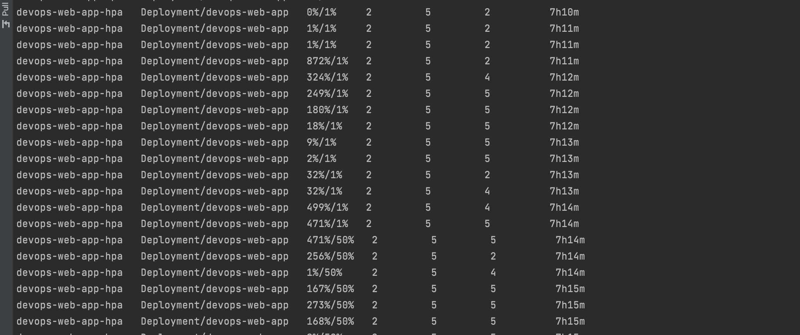

# Dev-Ops Aufgabe 2: Kubernetes

## Intro
In dieser Aufgabe erforschten wir die Mächtigkeit und Flexibilität von Kubernetes,
indem wir eine containerisierte Webanwendung deployten und skalierten. 
Das Ziel war es, ein grundlegendes Verständnis für die Kernkonzepte von Kubernetes 
zu erlangen und praktische Erfahrungen im Umgang mit Deployments, 
Services und dem Horizontal Pod Autoscaler zu sammeln.

## Scaling Strategies
Ich habe mich für die HorizontalPodAutoscaler (HPA) Strategie entschieden, 
weil sie automatisch die Anzahl der Pod-Replikas in einem Deployment 
oder ReplicaSet basierend auf der beobachteten CPU-Auslastung anpasst. 
Dies ist besonders nützlich, um die Anwendung während Lastspitzen zuverlässig 
und performant zu halten, ohne Ressourcen zu verschwenden, wenn die Last niedrig ist.

## Deployment
Um das Deployment zu beginnen, führen wir die folgenden Befehle aus:

```bash
kubectl apply -f deployment.yaml
kubectl apply -f service.yaml
kubectl apply -f components.yaml
kubectl apply -f hpa.yaml
```

Um zu testen, ob das ganze auch funktioniert, wurde der untenstehende Befehl verwendet, 
um ein Lastentest für die CPU zu machen:

```bash
kubectl run -i --tty load-generator --rm --image=busybox:1.28 --restart=Never -- /bin/sh -c "while sleep 0.01; do wget -q -O- http://devops-web-app-service/; done"
```

## Beschreibung der Funktionsweise der Scaling Strategie
Die HorizontalPodAutoscaler Strategie funktioniert durch Überwachen der 
CPU-Auslastung der Pods in einem Deployment. 
Wenn die Auslastung einen bestimmten Schwellenwert überschreitet, 
wird die Anzahl der Replikas erhöht, um die zusätzliche Last zu bewältigen. 

 
(Wenn kein Preview zu sehen ist, bitte die img.png Datei öffnen.)